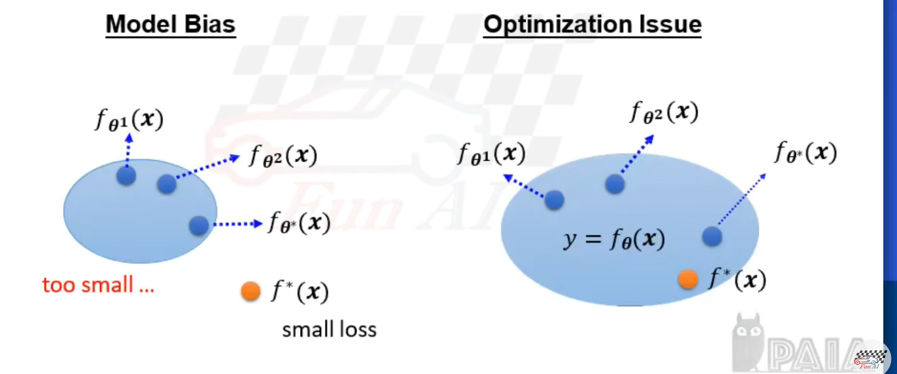

# AI 筆記
## 1 | Machine Learning
### 1-1 | What is Machine Learning?
Computers learning via `data` and `experience` to predict events is machine learning. 
For instance:
- Speech Recognition
- Image Recognition
- Game Playing
- etc...

### 1-2 | Machine Learning v.s. Deep Learning
- Machine Learning: Analyzing input data to produce corresponding output, letting systems possess the ability to study by itself.
- Deep Learning: Mostly refers to deep artificial neural networks, allowing `human-like` decision, judgment and learning.

### 1-3 | Different Tasks of Machine Learning
- Regression: Constructing a function that outputs a scalar and fits the scenario.
- Classification: Constructing a function that outputs a class and fits the scenario.

### 1-4 | Types of Machine Learning
- Supervised Learning
    - Trait Detection using Labeled Data
    - Compare label with results to compute difference and act accordingly
    - **Advantage**: Higher precision
    - **Disadvantage**: Requires manual operation to label traits. Almost impossible when facing unknown fields. 
- Unsupervised Learning
    - No markings on any data
    - Machine automatically finds traits on data and classifies on its own
    - **Advantages**: Drastically reduces complex human work.
    - **Disadvantages**: Lower accuracy, could produce biased results, produce ineffective grouping results and unimportant traits could be overmagnified.
- Semi-supervised Learning
    - Markings on little data
    - Machine finds traits based on marked data and performs classification
    - Because recognition foundations are present, results are often more accurate than unsupervised learning.
- Reinforcement Learning
    - Doesn't provide the machine any data, has the machine learn based on interactions with the environment
    - Learns based on positive and negative feedbacks to obtain a higher reward
    - Predictions become more accurate over time, and the machine more efficiently performs the action to reach the target.

#### Diagram

### 1-5 | 7 Steps of Machine Learning
1. Gathering data
2. Preparing data
3. Choosing a model
4. Training
5. Evaluation
6. Hyperparameter tuning
7. Prediction
### 1-6 | Model of Machine Learning
- SVM
- Decision Tree
- KNN
- Random Forest
- Gradient Boosting
- K-means
### 1-7 | Framework of Machine Learning
#### Overview
- Classify data into **training data** and **testing data**
- Train model
    1. Function with unknown
    2. Define loss from training data
    3. Optimization

#### Model Bias & Optimization

#### Underfitting & Overfitting
- **Underfitting**: The model cannot accurately explain the relationship between pieces of data.
    - <u>Resolution</u>: Selected too few input traits. Make the model more complex.
- **Overfitting**: The model overexplains data.
    - <u>Resolution</u>: Increase training data, data agumentation, make model simpler
#### Bias-Complexity Trade-off

## 2 | K-Means
### 2-1 | Intro
- K-Means is a type of **Unsupervised Learning**, which means it provides unlabeled data and there is no ground truth.
- The goal of K-means is to find representative data points in lots of multi-dimensional data by implementing:
    - Data Compression
    - Data Classification
- Firstly we decide the amount of clusters $k$ and repetitively iterate, each time reducing the value of the error function until the error function does not change, at which point we arrive at the final result of the classification.
### 2-2 | Instance
1. Randomly select a sample from the $K$ data points as the initial cluster center.
2. Assign each element to the cluster that corresponds to the closest cluster center.
3. Move the cluster center to the center of the elements it corresponds to.
4. Repeat steps 2 and 3 until conditions satisfy.
### 2-3 | Disadvantages
- We cannot predict the best $K$.
- The result of each classification would be different due to the random selection of the sample.
- Sometimes classifying cluster centers are important. (i.e. Different cluster centers might be desired to be in the same group)
- Restrictions on the data type.
    - We cannot measure the distance between individual points
    - Sizes
    - Densities
    - [Non-globular shapes](https://stats.stackexchange.com/questions/144746/k-means-for-non-spherical-non-globular-clusters)
- Result easily affected by noise or outliers